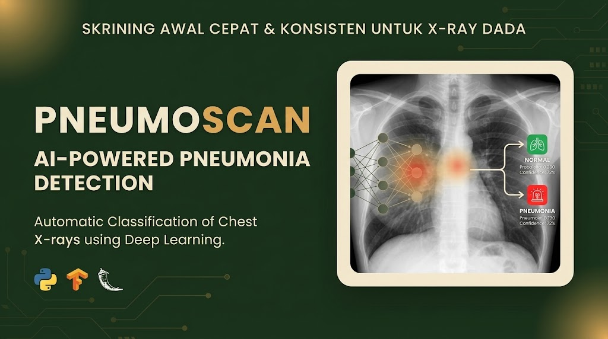
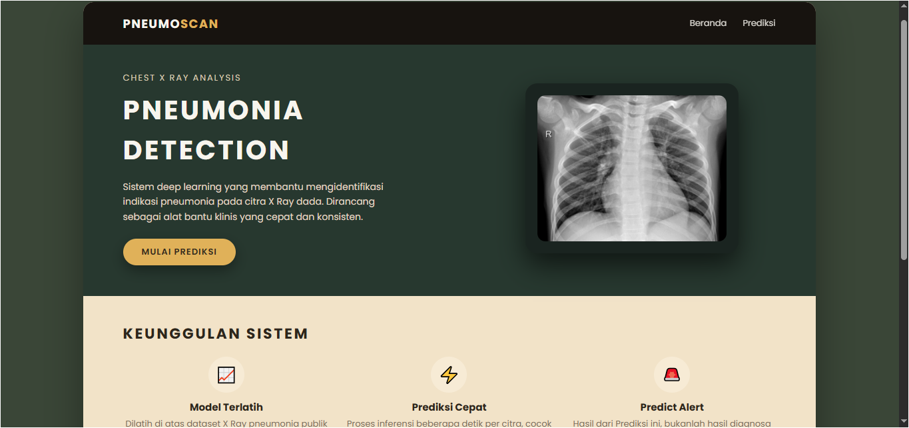
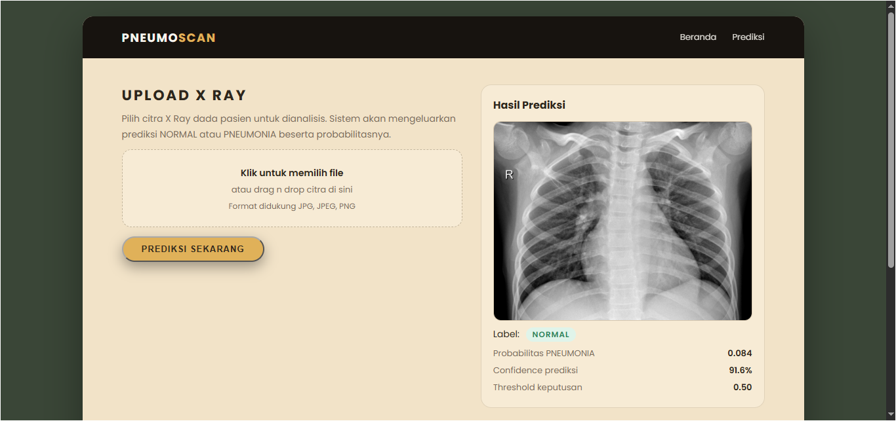
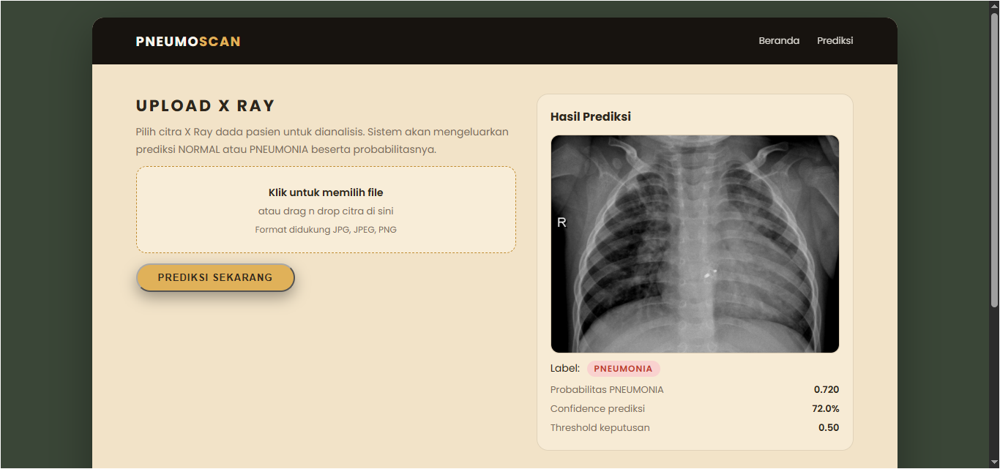

## 🫁 PnueScan: AI-Powered Pneumonia Detection


## 🫁 PneuScan
**AI-Powered Pneumonia Detection Web Application**


<br>



</div>

**PneuScan** adalah aplikasi web interaktif yang memanfaatkan *Deep Learning* untuk mendeteksi indikasi **Pneumonia** berdasarkan citra X-Ray dada (*Chest X-Ray*). Dibangun menggunakan ekosistem Python, Flask, dan TensorFlow, proyek ini mengemas model klasifikasi medis yang kompleks ke dalam antarmuka yang ramah pengguna untuk keperluan skrining awal.

> 💡 **Disclaimer:** Sistem ini dibangun untuk keperluan eksperimen dan edukasi *Machine Learning*. Hasil prediksi belum dapat menggantikan diagnosis medis dari tenaga profesional.

---

## 🌟 Fitur Utama

- 🧠 **Deteksi Cepat & Akurat:** Mengklasifikasikan citra X-Ray ke dalam kategori **NORMAL** atau **PNEUMONIA** secara otomatis.
- 🖥️ **Antarmuka User-Friendly:** Desain web sederhana yang memungkinkan pengguna mengunggah gambar dan melihat hasil diagnosis langsung dari *browser* tanpa menyentuh kode.
- 📦 **Pre-trained CNN Model:** Didukung oleh model *Convolutional Neural Network* (CNN) yang telah dievaluasi menggunakan dataset citra medis berskala besar.
- 🖼️ **Dukungan Format Universal:** Kompatibel dengan format gambar standar seperti `.jpg`, `.jpeg`, dan `.png`.
- 🧪 **Data Uji Tersedia:** Dilengkapi dengan contoh gambar X-Ray bawaan di dalam repositori untuk kemudahan pengujian instan.

---

## 📸 Contoh Hasil Prediksi

Sistem akan menampilkan visualisasi citra yang diunggah beserta label probabilitas (*confidence score*) secara langsung pada antarmuka web.

**1. Hasil Analisis - Kategori NORMAL**


**2. Hasil Analisis - Kategori PNEUMONIA**


---

## 🌟 Fitur Utama

* **Deteksi Otomatis:** Mengklasifikasikan gambar X-Ray menjadi dua kategori: **NORMAL** atau **PNEUMONIA**.
* **Antarmuka Web User-Friendly:** Memudahkan pengguna untuk mengunggah gambar dan melihat hasil diagnosis tanpa perlu menyentuh kode.
* **Pre-trained Model:** Menggunakan model CNN (Convolutional Neural Network) yang telah dilatih dengan ribuan dataset citra medis.
* **Dukungan Format Gambar:** Mendukung format umum seperti `.jpg`, `.jpeg`, dan `.png`.
* **Gambar Referensi:** Menyertakan contoh gambar X-Ray bawaan untuk keperluan pengujian.

---

## 🛠️ Teknologi yang Digunakan

Proyek ini dibangun di atas tumpukan teknologi berikut:

* **Bahasa Pemrograman:** [Python](https://www.python.org/)
* **Web Framework:** [Flask](https://flask.palletsprojects.com/)
* **Machine Learning:** [TensorFlow](https://www.tensorflow.org/) & [Keras](https://keras.io/)
* **Data Processing:** NumPy, Pillow (PIL)
* **Frontend:** HTML5, CSS3

---

## 📂 Susunan Proyek
Berikut adalah struktur direktori dari repositori ini:
```bash
pnuescan/
├── app.py                  # 🚀 File utama aplikasi (Entry point Flask)
├── model.h5                # 🧠 File model AI yang sudah dilatih (Weights)
├── requirements.txt        # 📦 Daftar dependensi library Python
├── pneumonia_kagglehub...  # 📓 Jupyter Notebook (Dokumentasi pelatihan model)
├── static/                 # 🎨 Aset statis (CSS, Gambar)
│   ├── css/                # Stylesheet untuk tampilan web
│   ├── references/         # 🖼️ Gambar contoh (Normal & Pneumonia) untuk tes
│   └── uploads/            # 📂 Folder penyimpanan sementara gambar yang diupload
└── templates/              # 📄 Template HTML (Frontend)
    ├── base.html           # Layout dasar
    ├── home.html           # Halaman utama (Upload)
    └── predict.html        # Halaman hasil prediksi
```
## ⚙️ Prasyarat Instalasi
Sebelum menjalankan aplikasi, pastikan komputer Anda telah terinstal:
1. Python 3.8 atau versi yang lebih baru.
2. PIP (Python Package Installer).
3. Git (Opsional, untuk clone repository).

## 🚀 Cara Menjalankan (Instalasi)
Ikuti langkah-langkah berikut untuk menjalankan PnueScan di komputer lokal (Localhost):
1. Clone Repositori
Unduh kode sumber proyek ini ke komputer Anda.
```bash
git clone [https://github.com/username-anda/pnuescan.git](https://github.com/username-anda/pnuescan.git)
cd pnuescan
```
2. Buat Virtual Environment (Disarankan)
Sangat disarankan menggunakan virtual environment agar library tidak bentrok.
Windows:
```bash
python -m venv venv
venv\Scripts\activate
```
macOS / Linux:
```bash
python3 -m venv venv
source venv/bin/activate
```
3. Install Dependensi
Install semua library yang dibutuhkan yang terdaftar di requirements.txt.
```bash
pip install -r requirements.txt
```
4. Jalankan Aplikasi
Jalankan server Flask dengan perintah:
```bash
python app.py
```
5. Akses di Browser
Buka browser (Chrome, Firefox, dll) dan kunjungi alamat berikut: http://127.0.0.1:5000 atau http://localhost:5000

## 🧪 Contoh Penggunaan
1. Buka halaman utama aplikasi di browser.
2. Klik tombol "Choose File" atau "Upload Image".
3. Pilih gambar X-Ray paru-paru.
Tips: Jika Anda tidak memiliki gambar X-Ray, gunakan gambar yang ada di folder static/references/.
4. Klik tombol "Predict".
5. Sistem akan menampilkan hasil analisis apakah paru-paru tersebut Normal atau terindikasi Pneumonia.

## 🤝 Kontribusi
Kontribusi selalu diterima! Jika Anda ingin meningkatkan performa model, memperbaiki bug, atau mempercantik tampilan:
1. Fork repositori ini.
2. Buat branch fitur baru (git checkout -b fitur-keren-anda).
3. Commit perubahan Anda (git commit -m 'Menambahkan fitur keren').
4. Push ke branch (git push origin fitur-keren-anda).
5. Buat Pull Request baru.
